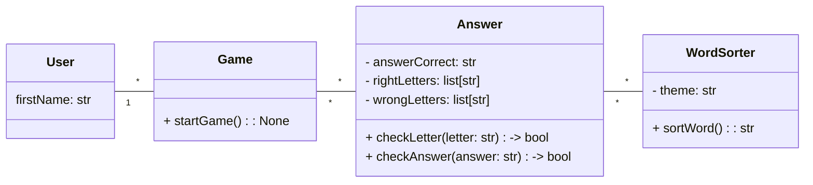

# Tarefa - Jogo da Forca

## Pontuações

1. Sortear palavra dentro de um banco de palavras (Tema)
2. Jogador escolhe um tema
3. Jogador faz palpite
4. Jogo verifica acerto
5. Guardar letras acertadas e erradas

## Listar Responsabilidades

1. **Usuários:**
    a. Jogador

2. **Entidades:**
    a. User:
        * firstName: str
    b. Game:
        * startGame() -> None
    b. WordSorter
        * theme: str
        * sortWord() -> str
    c. Answer
        * answerCorrect: str
        * rightLetters: list[str]
        * wrongLetters: list[str]
        * checkLetter(letter: str) -> None
        * checkAnswer(answer: str) -> bool

## Diagrama de Classes

