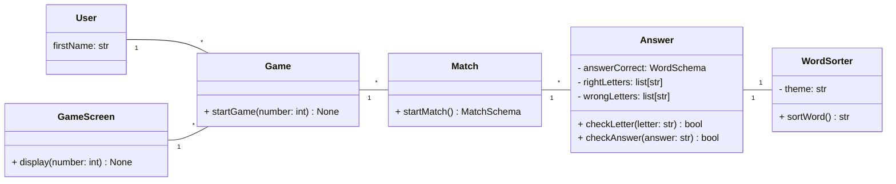

# Tarefa - Jogo da Forca

## Pontuações

1. Sortear palavra dentro de um banco de palavras (Tema)
2. Jogador escolhe um tema
3. Jogador faz palpite
4. Jogo verifica acerto
5. Guardar letras acertadas e erradas

## Listar Responsabilidades

1. **Usuários:**
    a. Jogador

2. **Entidades:**
    
    a. **User:**
    * firstName: str
    
    b. **GameScreen:**
    * display() -> None
    
    b. **Game:**
    * startGame(number: int) -> None
    
    c. **Match:**
    * startMatch() -> MatchSchema
    
    d. **WordSorter:**
    * theme: str
    * sortWord() -> str
    
    e. **Answer:**
    * answerCorrect: WordSchema
    * rightLetters: list[str]
    * wrongLetters: list[str]
    * checkLetter(letter: str) -> None
    * checkAnswer(answer: str) -> bool

## Diagrama de Classes

