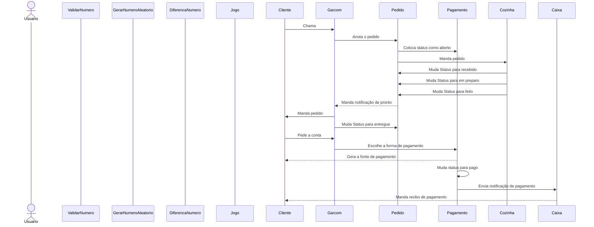

*Listar as responsabilidades:*

*Ator:*
Usuário

*Entidades:*
1. ValidarNumero:
    * numeroIgual
2. GerarNumeroAleatorio:
    * gerarNumero
3. DiferencaNumero:
    * informarMaiorOuMenor
4. Jogo:
    * informarResultado
4. Menu:
    * gerarMenu

---

